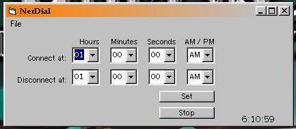

<div align="center">

## Connect and Disconnect internet at selected time


</div>

### Description

Connect and/or Disconnect from internet at selected times. VERY GOOD anti-phone solicitor program. Set it to dial at 8:00, and disconnect at whatever time u think u'll be up. I am not finished yet, but this is what i have done, you will be able to disable one of the options with next version, but here ya go, questions email me.
 
### More Info
 
Two things, if you have the connection properties set to "Never Dial a Connection" the api will not work. Secondly, i use Juno, if i dial a connection with juno, and try to use this to disconnect, it will not. Im not sure about other services, but it will not disconnect from internet when third party software connects, and this is not possible for me to fix at this time, i will try to find a way to. It will however disconnect if you use the dialup that the program uses, which is the same as what IE uses. If i come across anything else, i will post it, if you come across something, please also post it, i will try to fix it.


<span>             |<span>
---                |---
**Submitted On**   |2002-06-19 20:51:36
**By**             |[Scott Davis](https://github.com/Planet-Source-Code/PSCIndex/blob/master/ByAuthor/scott-davis.md)
**Level**          |Intermediate
**User Rating**    |4.7 (28 globes from 6 users)
**Compatibility**  |VB 6\.0
**Category**       |[Internet/ HTML](https://github.com/Planet-Source-Code/PSCIndex/blob/master/ByCategory/internet-html__1-34.md)
**World**          |[Visual Basic](https://github.com/Planet-Source-Code/PSCIndex/blob/master/ByWorld/visual-basic.md)
**Archive File**   |[Connect\_an976586222002\.zip](https://github.com/Planet-Source-Code/scott-davis-connect-and-disconnect-internet-at-selected-time__1-35635/archive/master.zip)

### API Declarations

```
Private Declare Function InternetAutodial Lib "wininet.dll" (ByVal dwFlags As Long, ByVal dwReserved As Long) As Long
Private Declare Function InternetAutodialHangup Lib "wininet.dll" (ByVal dwReserved As Long) As Long
Private Const INTERNET_AUTODIAL_FORCE_ONLINE = 1
Private Const INTERNET_AUTODIAL_FORCE_UNATTENDED = 2
'Not code from program, but examples on how to use api if you dont want to download
'Connect normally
InternetAutodial INTERNET_AUTODIAL_FORCE_ONLINE, 0
'Force connect
InternetAutodial INTERNET_AUTODIAL_FORCE_UNATTENDED,0
'Disconnect
InternetAutoDialHangup 0
```


